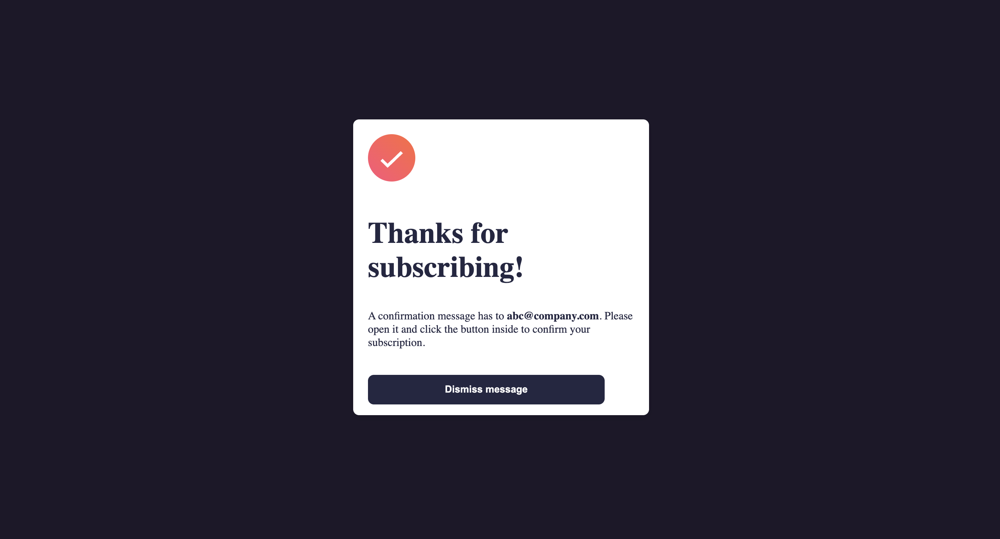

# Overview

### The challenge

Users should be able to:

- Add their email and submit the form
- See a success message with their email after successfully submitting the form
- See form validation messages if:
  - The field is left empty
  - The email address is not formatted correctly
- See hover and focus states for all interactive elements on the page

### Screenshots

### Links

- Solution URL: [Github URL](https://github.com/gkuzivam/newsletter-sign-up/tree/main)
- Live Site URL: [Live site URL](https://gkuzivam.github.io/newsletter-sign-up/)

## Built with

- Semantic HTML5 markup
- CSS custom properties
- Flexbox
- Javascript

